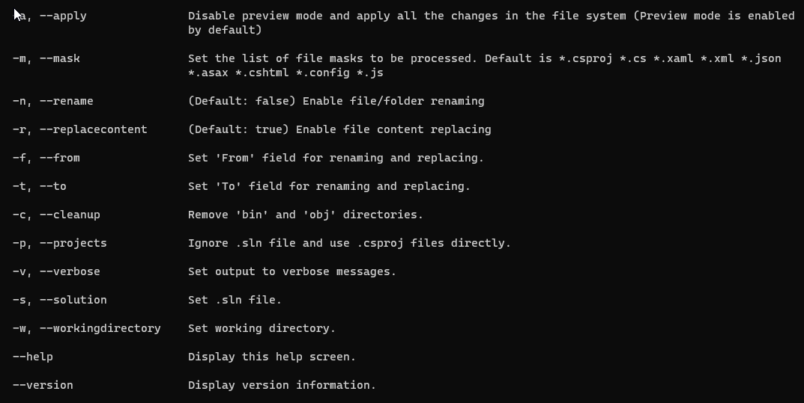
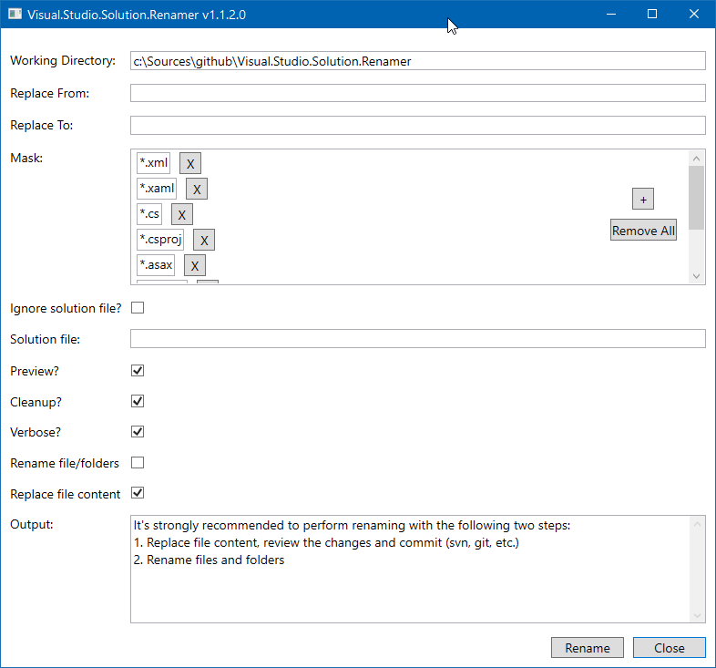

Visual Studio Solution Renamer
===

Allows to rename a solution, its projects and namespaces.<br/>
Please note *Preview* mode is supported and enabled by default.

Get started
---

The tool is intended to be used as a global dotnet tool. 

```shell
dotnet tool install -g vsrenamer
```

Then you can run it directly from the command line:

```shell
vsrenamer.exe -w <solution directory> [other parameters]
```

Examples:
```shell
vsrenamer.exe --help
vsrenamer.exe -a -f Old -t New -c -w .\src --rename false --replacecontent true
vsrenamer.exe -a -f Old -t New -c -w .\src --rename true  --replacecontent false
vsrenamer.exe --workingdirectory c:\Sources\projectA\src\ --apply --from projectA --to projectAAA --solution MySolution.sln
vsrenamer.exe -w c:\Sources\projectA\src\ --apply --cleanup
vsrenamer.exe -w c:\Sources\projectB\src\ -a -f projectB -t projectBBB -c --projects --mask "*.csproj *.cs *.xaml"
vsrenamer.exe -w c:\Sources\projectC\src\ -a -f projectC -t projectCCC -c --verbose
```

If you need to update a solution with ".." paths you can use the following command line:
```shell
vsrenamer.exe -w c:\Sources\projectD\src\ -a -f projectD -t projectDDD -c -m "*.sln *.csproj *.xaml *.cs *.xml" -p
```

Also you can install and run its GUI version
```shell
dotnet tool install -g vsrenamer_gui
vsrenamer_gui.exe
```

<details>
  <summary>Screenshots...</summary>
  
  
  <br/>
  
</details>
<br/>

Under the hood
---

Here is the list of actions to be done during the process of renaming
- Rename .sln file
- Rename .csproj files
- Rename parent folder of the projects
- Update their relative paths in the .sln file
- Set proper AssemblyName and RootNamespace in the .csproj files
- Replace text in files. By default, *.cs *.xaml *.xml *.json *.asax *.cshtml *.config *.js


Limitations
---

- A single solution file only (.sln)
- A single project (.csproj) per folder
- C# projects only
- No source version control history support

Be aware
---

- &#x1F534; No backup feature
- &#x1F534; No roll-back feature
- &#x1F534; No proper symlinks support
- &#x1F534; Tested with
    - Microsoft Visual Studio Solution File, Format Version 12.00
    - Visual Studio Version 16 (2019)
- &#x1F534; It's strongly recommended to perform renaming with the following two steps:
    1. Replace file content, review the changes and commit (svn, git, etc.)
    2. Rename files and folders

References
---

* [Serilog](https://serilog.net/) library
    * [Apache 2.0 License](https://www.apache.org/licenses/LICENSE-2.0)
* [Command Line Parser Library for CLR and NetStandard](https://github.com/commandlineparser/commandline)
    * [MIT License](https://github.com/zzzprojects/html-agility-pack/blob/master/LICENSE)
* [Microsoft.Build](https://github.com/dotnet/msbuild) library
    * [MIT License](https://github.com/zzzprojects/html-agility-pack/blob/master/LICENSE)
